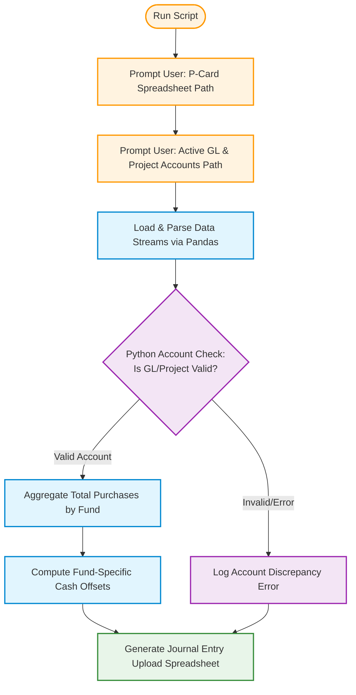

## finance-data-pipeline

**Try it Out**
1.  Run mock_generator.py to created mock spreadsheets
2.  Run reconciler.py to see how it works
   
***An automated data reconciliation and auditing pipeline built in Python.*** 
Automated Expense Auditor (LedgerSync)An automated data reconciliation and auditing pipeline built in Python. This utility replaces manual, line-by-line spreadsheet verification by dynamically cross-referencing high-volume purchasing card program statements against enterprise general ledger (GL) and project accounts.

**📖 How It Works**
The script runs as an interactive command-line tool designed for financial administrators.

* **User Ingestion Prompts:** The program prompts the user to enter the local file pathway for the target purchasing card reconciliation spreadsheet. It then requests the file pathway for the active GL and project accounts exported from the budgeting software.
*  **Data Integrity Auditing:** The script uses pandas to execute a validation check, cross-referencing each transaction in the reconciliation file against the master list of active, valid GL and project accounts to catch entry errors.
* **Aggregation & Fund Accounting:** Validated purchases are programmatically aggregated by their respective fund codes.
* **Journal Entry Export:** Finally, the script automatically calculates the necessary cash offsets for each fund and generates a structured, audit-ready spreadsheet optimized for direct journal entry upload into the enterprise budgeting software.

📊 Process Flow Architecture

    
🚀 Impact & Business Value
* **Efficiency:**
Replaces manual visual validation, accelerating weekly ledger verification.
* **Accuracy:** Mitigates human data-entry errors by checking every account code programmatically before upload.
* **Risk Mitigation:** Automatically isolates unallocated transactions or invalid account configurations before they touch the master ledger.

🔒 Confidentiality NoticeNote: 
To maintain professional confidentiality and comply with data privacy standards, all real-world financial records, proprietary system architectures, and sensitive institutional identifiers have been completely stripped from this public repository. The project uses synthesized, randomized mock data generated purely to demonstrate the architectural pipeline and matching logic.
